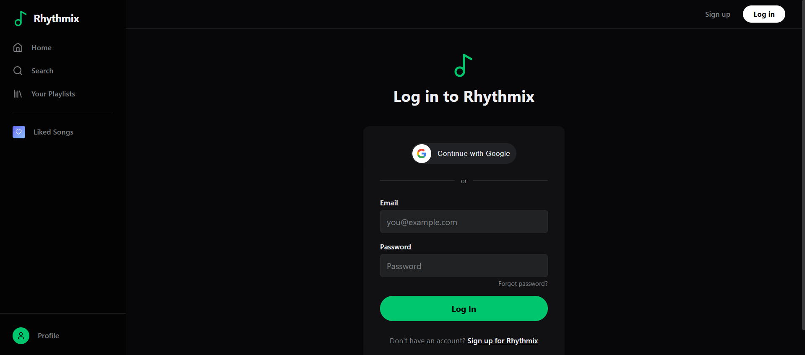
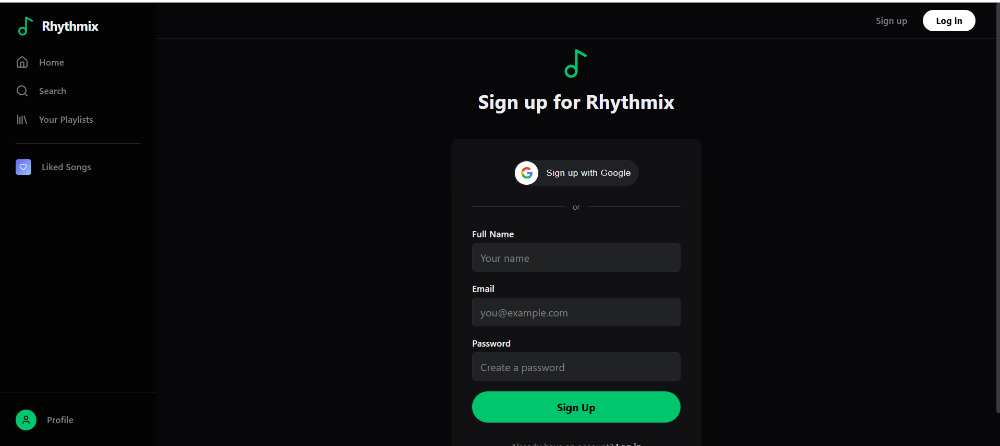
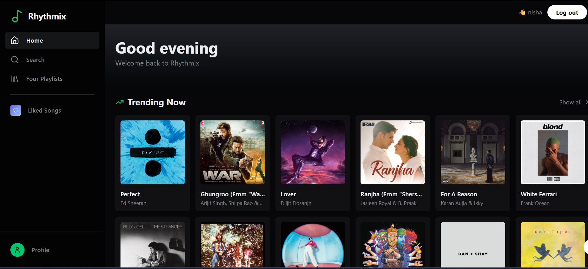
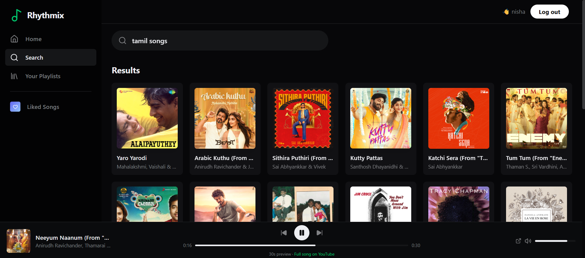
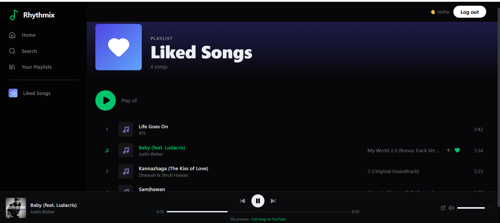
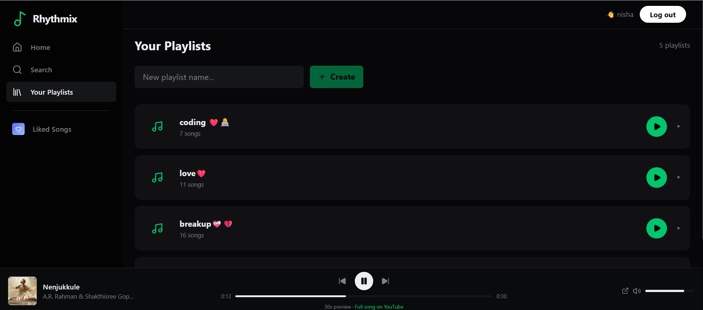
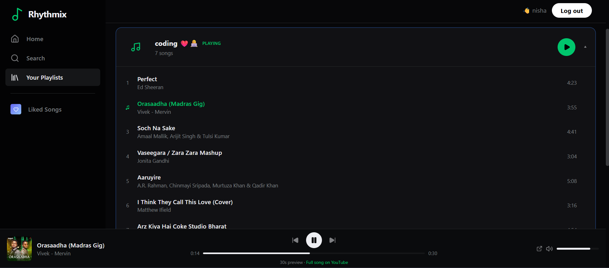

# 🎵 Rhythmix Frontend

<div align="center">


**A Spotify-inspired music player web app built with React, Tailwind CSS, Framer Motion, and the iTunes API.**

[Features](#-features) • [Tech Stack](#-tech-stack) • [Getting Started](#-getting-started) • [Project Structure](#-project-structure) • [Screenshots](#-screenshots) • [Contributing](#-contributing)

</div>

---

## 📋 Table of Contents

- [Overview](#-overview)
- [Features](#-features)
- [Tech Stack](#-tech-stack)
- [Getting Started](#-getting-started)
  - [Prerequisites](#prerequisites)
  - [Installation](#installation)
  - [Environment Variables](#environment-variables)
  - [Running the App](#running-the-app)
- [Project Structure](#-project-structure)
- [Pages & Components](#-pages--components)
- [API Integration](#-api-integration)
- [Music Playback](#-music-playback)
- [Future Improvements](#-future-improvements)
- [Contributing](#-contributing)
- [License](#-license)

---

## 🌟 Overview

Rhythmix Frontend is a full-featured music player application with a dark Spotify-like UI. Users can search millions of songs via the iTunes API, play 30-second previews, create playlists, like songs, and manage their profile. The app features real-time search, smooth animations, and a persistent music player that stays visible across all pages.

---

## ✨ Features

### 🎵 Music
- **Real-time song search** — debounced live search via iTunes API (no API key needed)
- **30-second previews** — play audio previews directly in the browser
- **Music player** — persistent bottom player with play/pause/skip/seek/volume
- **Auto-play next** — automatically plays next song in queue when current ends
- **Album art** — high-quality 500x500 artwork from iTunes

### 📁 Library Management
- **Playlists** — create, expand/collapse, play all songs
- **Add to playlist** — modal with playlist selector, creates playlist inline if none exist
- **Favorites** — like/unlike songs, play all liked songs
- **Remove songs** — remove from playlist or favorites

### 🔐 Authentication
- **Email/password** — register, login with JWT
- **Google Sign In** — one-click Google OAuth login
- **Email verification** — verify account before first login
- **Forgot password** — reset via email link
- **Password strength** — visual indicator on reset

### 👤 Profile
- **Account stats** — playlists, liked songs, library count
- **Edit name** — inline edit with save/cancel
- **Change password** — with current password verification
- **Google users** — see "Managed by Google" instead of password form
- **Delete account** — with confirmation dialog

### 🎨 UI/UX
- **Spotify-dark theme** — dark design with green accents
- **Framer Motion** — smooth page and card animations
- **Skeleton loaders** — while content loads
- **Responsive sidebar** — hidden on mobile, visible on desktop
- **Toast notifications** — success/error feedback
- **Genre mix cards** — browse by genre on home page
- **Trending section** — random trending songs on home page

---

## 🛠 Tech Stack

| Technology | Purpose |
|---|---|
| React 19 | UI framework |
| Vite | Build tool & dev server |
| Tailwind CSS 3 | Utility-first styling |
| React Router DOM 6 | Client-side routing |
| Framer Motion | Animations |
| Axios | HTTP client |
| Sonner | Toast notifications |
| Lucide React | Icon library |
| iTunes Search API | Song search & metadata (free, no key) |
| Google OAuth (@react-oauth/google) | Google Sign In |
| useSyncExternalStore | Global music player state |

---

## 🚀 Getting Started

### Prerequisites

- **Node.js 18+** — [Download](https://nodejs.org/)
- **npm 9+** — comes with Node.js
- **Rhythmix Backend** running on `http://localhost:8081`
- **Google OAuth Client ID** (for Google Sign In)

### Installation

**1. Clone the repository**

```bash
git clone https://github.com/Pooja-V4/rhythmix-frontend.git
cd rhythmix-frontend
```

**2. Install dependencies**

```bash
npm install
```

### Environment Variables

Create a `.env` file in the project root:

```env
VITE_GOOGLE_CLIENT_ID=your_google_client_id.apps.googleusercontent.com
```

**Google Client ID setup:**
```
1. Go to https://console.cloud.google.com
2. Create Project → Rhythmix
3. APIs & Services → OAuth Consent Screen → External
4. Credentials → Create OAuth Client ID → Web Application
5. Authorized JavaScript origins: http://localhost:5173
6. Authorized redirect URIs: http://localhost:5173
7. Copy Client ID → paste in .env
```

### Running the App

```bash
# Development server
npm run dev
```

App starts at: `http://localhost:5173`

> ⚠️ Make sure the Rhythmix Backend is running on port 8081(backend port number) before starting the frontend.

---

## 📁 Project Structure

```
rhythmix-frontend/
├── public/
│   └── vite.svg
├── src/
│   ├── api/
│   │   └── axios.js              # Axios instance + JWT interceptor + all API calls
│   ├── components/
│   │   ├── AppSidebar.jsx        # Left navigation sidebar
│   │   ├── TopBar.jsx            # Top header with auth buttons
│   │   ├── MusicPlayer.jsx       # Fixed bottom music player
│   │   ├── SongCard.jsx          # Grid song card with hover actions
│   │   ├── SongRow.jsx           # List song row with hover actions
│   │   └── AddToPlaylistModal.jsx # Modal for adding songs to playlist
│   ├── lib/
│   │   ├── auth.js               # localStorage auth helpers
│   │   ├── musicSearch.js        # iTunes API search function
│   │   ├── playerStore.js        # Global audio player state (no Redux needed)
│   │   └── utils.js              # cn() helper for Tailwind class merging
│   ├── pages/
│   │   ├── Home.jsx              # Landing + logged-in dashboard
│   │   ├── Login.jsx             # Email/password + Google login
│   │   ├── Signup.jsx            # Registration + Google signup
│   │   ├── Dashboard.jsx         # Liked songs page
│   │   ├── Playlists.jsx         # Playlist management
│   │   ├── Search.jsx            # Song search with categories
│   │   ├── Profile.jsx           # User profile + settings
│   │   ├── VerifyEmail.jsx       # Email verification handler
│   │   ├── ForgotPassword.jsx    # Forgot password form
│   │   └── ResetPassword.jsx     # Reset password form with strength meter
│   ├── App.jsx                   # Router setup + layout
│   ├── main.jsx                  # Entry point + GoogleOAuthProvider
│   └── index.css                 # Tailwind imports + custom scrollbar
├── .env                          # Environment variables (not committed)
├── .gitignore
├── index.html
├── package.json
├── tailwind.config.js
└── vite.config.js
```

---

## 📸 Screenshots

### 🔐 Login Page


### 🔐 Sign Up Page


### 🏠 home Page


### 🔍 Search


### ❤️ Like


### 📃 Playlist



---
## 📄 Pages & Components

### Pages

| Page | Route | Description |
|---|---|---|
| Home | `/` | Trending songs + genre mixes. Shows landing page if not logged in |
| Login | `/login` | Email/password + Google Sign In + forgot password link |
| Signup | `/signup` | Registration form + Google Sign Up + email sent screen |
| Dashboard | `/dashboard` | Liked Songs playlist with play all |
| Playlists | `/playlists` | Create playlists, add/remove songs, play playlist |
| Search | `/search` | Live search with debounce, browse categories |
| Profile | `/profile` | Stats, edit name, change password, delete account |
| Verify Email | `/verify-email` | Handles verification link from email |
| Forgot Password | `/forgot-password` | Request password reset email |
| Reset Password | `/reset-password` | Set new password with strength indicator |

### Key Components

#### `MusicPlayer.jsx`
Persistent bottom bar showing current song, controls, and volume. Uses `useSyncExternalStore` for global state without Redux.

#### `AddToPlaylistModal.jsx`
Popup that shows all user playlists. Saves song to backend DB first, then adds to chosen playlist. Can create a new playlist inline if none exist.

#### `SongCard.jsx`
Grid card with album art, hover play button, heart (favorite) and plus (playlist) action buttons.

#### `SongRow.jsx`
List row format for dashboard and playlist pages. Shows index number, art, title, artist, album, and action buttons on hover.

---

## 🌐 API Integration

### Backend API (Rhythmix Backend)

All requests to `http://localhost:8081` automatically include the JWT token via Axios interceptor:

```javascript
// src/api/axios.js
API.interceptors.request.use((config) => {
  const token = getToken();
  if (token) {
    config.headers.Authorization = `Bearer ${token}`;
  }
  return config;
});
```

If a 401 response is received (token expired), the user is automatically logged out and redirected to `/login`.

### iTunes API (Free, No Key Required)

```javascript
// src/lib/musicSearch.js
const response = await fetch(
  `https://itunes.apple.com/search?term=${query}&media=music&limit=30`
);
```

Returns: title, artist, album, artwork (500x500), 30-second preview URL, duration.

### Google OAuth

```javascript
// src/main.jsx
<GoogleOAuthProvider clientId={import.meta.env.VITE_GOOGLE_CLIENT_ID}>
  <App />
</GoogleOAuthProvider>
```

The Google credential token is sent to `/auth/google` on the backend for verification.

---

## 🎵 Music Playback

The music player uses a custom global state store built with `useSyncExternalStore` — no Redux or Zustand needed.

```
Player Store (src/lib/playerStore.js)
├── State: currentSong, queue, isPlaying, progress, volume
├── HTML5 Audio element — single global instance
├── playSong(song, queue, index) — fetches iTunes preview if URL missing
├── togglePlay() — play/pause
├── playNext() / playPrev() — skip through queue
├── seekTo(percent) — seek to position
└── setVolume(0-1) — adjust volume
```

**Smart preview fetching:** Songs saved to the backend don't store preview URLs. When played, the player automatically searches iTunes for the matching song and fetches the preview URL on the fly.

---

## 🔮 Future Improvements

### Short Term
-  Mobile responsive layout (hamburger menu, bottom nav)
-  PWA support (installable, offline capability)
-  Keyboard shortcuts (Space to play/pause, arrows to skip)
-  Search with live debounce in backend (not just iTunes)
-  Song queue display (see what's coming next)

### Medium Term
-  Dark/light theme toggle
-  Shuffle and repeat modes
-  Drag and drop to reorder playlist songs
-  Recently played history
-  Song sharing (copy link)
-  Artist page (all songs by an artist)

### Long Term
-  Mobile app (React Native)
-  Lyrics display (via lyrics API)
-  Collaborative playlists (share with other users)
-  Equalizer / audio visualizer
-  Social features (follow users, see what friends are playing)
-  Offline mode (cache songs in IndexedDB)

### Technical Improvements
-  TypeScript migration
-  Unit tests with Vitest
-  E2E tests with Playwright
-  Lazy loading for routes
-  Image optimization
-  Bundle size analysis

---

## 🤝 Contributing

Contributions, issues, and feature requests are welcome!

**1. Fork the repository**

```bash
git clone https://github.com/Pooja-V4/rhythmix-frontend.git
cd rhythmix-frontend
```

**2. Create a feature branch**

```bash
git checkout -b feature/your-feature-name
```

**3. Install dependencies and start dev server**

```bash
npm install
npm run dev
```

**4. Make your changes**

**5. Commit with a meaningful message**

```bash
git add .
git commit -m "feat: add your feature description"
```

**6. Push and create a Pull Request**

```bash
git push origin feature/your-feature-name
```

### Commit Message Convention

```
feat:     new feature
fix:      bug fix
style:    styling changes
refactor: code refactoring
docs:     documentation update
chore:    config or build changes
```

### Code Style Guidelines
- Use functional components with hooks
- Keep components focused — one responsibility per component
- Put API calls in `src/api/axios.js` — not inside components
- Use Tailwind classes — avoid inline styles where possible
- Name files with PascalCase for components, camelCase for utilities

---


## 👩‍💻 Author

**Pooja**
- GitHub: [Pooja-V4](https://github.com/Pooja-V4)

---

## 🔗 Related

- [Rhythmix Backend](https://github.com/Pooja-V4/rhythmix-backend) — Spring Boot REST API

---

<div align="center">
Built with ❤️ using React · Tailwind CSS · iTunes API · Spring Boot
</div>
